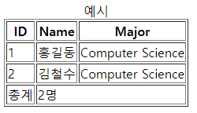
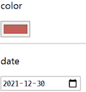
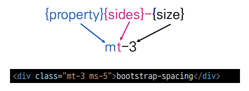

# Web - 05

## table tag

* 태그 정리

  |    태그     | 비고                                        |
  | :---------: | ------------------------------------------- |
  | **<table>** | 테이블 만드는 태그                          |
  |   <thead>   | 시맨틱 태그, 필수가 아님, 한번만 사용 가능  |
  |   <tbody>   | 시맨틱 태그, 필수가 아님, 여러 번 사용 가능 |
  |   <tfoot>   | 시맨틱 태그, 필수가 아님, 한번만 사용 가능  |
  |  <caption>  | 필수가 아님, 표의 설명이나 제목을 나타냄.   |
  |  **<th>**   | 테이블 헤더 부분 만드는 태그                |
  |  **<tr>**   | 테이블 행 만드는 태그                       |
  |  **<td>**   | 테이블 열 만드는 태그                       |

* 예시 코드

  ```html
  <!DOCTYPE html>
  <html>
  <head>
  <title>Page Title</title>
  </head>
  <body>
  
  <table border=1>
  	<caption>예시</caption>
  	<thead>
      	<tr>
          	<th>ID</th>
              <th>Name</th>
              <th>Major</th>
          </tr>
      </thead>
      <tbody>
      	<tr>
          	<td>1</td>
              <td>홍길동</td>
              <td>Computer Science</td>
          </tr>
          <tr>
          	<td>2</td>
              <td>김철수</td>
              <td>Computer Science</td>
          </tr>
      </tbody>
      <tfoot>
      	<tr>
          	<td>총계</td>
              <td colspan="2">2명</td>
          </tr>
      </tfoot>
  </table>
  
  </body>
  </html>
  ```

* 결과

  

  

## form 태그

* 데이터를 서버에 제출할 때 사용되는 태그이다.

* 기본 속성

  * action : form 처리할 서버의 URL(데이터 수신지)
  * method : form 제출할 때 사용할 HTTP method(GET, POST, ...)
  * enctype : method 가 POST 일 때, 데이터의 유형
    *  application/x-www-form-urlencoded : 기본값
    * multipart/form-data : 파일 전송 시(input type 이 file 일 경우)
    * text/plain : HTML5 디버깅용

* 예시는 input 태그 예시에 기재했다.

  

## input 태그

* 다양한 타입 가지는 입력 데이터 유형과 위젯이 제공되는 태그이다.

* 대표적 속성

  * name : form control 에 적용되는 이름(이름/ 값 쌍으로 전송)
  * value : form control 에 적용되는 값(이름/ 값 쌍으로 전송)
  * required, readonly, autofocus, disabled, ...

* 예시

  ```html
  <form action="/search" method="GET">
      <input type="text" name="q">
  </form>
  ```


## label 태그

* label 을 클릭해서 input 자체 초점을 맞추거나 활성화를 시킬 수 있다.

  * 사용자는 선택할 수 있는 영역이 늘어나 웹 / 모바일 환경에서 편하게 사용할 수 있다.
  * label 과 input 입력 관계가 시각적 뿐만이 아닌 화면리더기에서도 label을 읽어 쉽게 내용을 확인할 수 있도록 한다.

* input 태그에는 id 속성의 값을, label 태그에는 for 속성의 값을 일치시킨다.

* 예시

  ```html
  <label for="agreement">개인 정보 수집에 동의합니다.</label>
  <input type="checkbox" name="agreement" id="agreement">
  ```


## input 태그 type 속성 값

### 일반

* text : 일반 텍스트 값
* password : 입력 시 값이 보이지 않고 대신 특수기호(*) 로 표현된다.
* email : 이메일 형식이 아닌 경우 form 제출 불가
* number : min, max, step 속성을 활용하여 숫자 범위 설정이 가능하다.
* file : accept 속성을 활용하여 파일 타입 지정 가능.

### 항목 중 선택

* 일반적으로 label 태그와 함께 사용된다.

* 동일 항목에 대해 name 을 지정하고, 선택된 항목에 대한 value 를 지정 해야한다.

  * checkbox : 다중 선택
  * radio : 단일 선택

* 예시

  ```html
  <div>
      <p>checkbox</p>
      <input id="html" type="checkbox" name="language" value="html">
      <label for="html">HTML</label>
      <input id="python" type="checkbox" name="language" value="python">
      <label for="python">파이썬</label>
      <input id="python" type="checkbox" name="language" value="java">
      <label for="java">자바</label>
  </div>
  ```

### 기타

* 다양한 종류의 input 을 위한 picker 가 제공된다.
  * color : color picker
  * date : date picker

* 예시

  

  

## 부트스트랩

* css 클래스 명명 규칙 : spacing

  

* property
  * m : margin
  * p : padding
  
* sides
  * t : margin-top or padding-top 지정
  
  * b : margin-bottom or padding-bottom 지정
  
  * s : 왼쪽에서 오른쪽 방향으로 margin-left or padding-left 지정하거나 
  
    ​     오른쪽에서 왼쪽 방향으로 margin-right or padding-right 지정 
  
  * e : 왼쪽에서 오른쪽 방향으로 margin-right or padding-right 지정하거나 
  
    ​     오른쪽에서 왼쪽 방향으로 margin-left or padding-left 지정
  
  * x : margin, padding 좌우 모두 지정
  
  * y : margin, padding 상하 모두 지정
  
  * blank : margin or padding 4방향 모두 지정
  
* size
  * $spacer 값 기준으로 지정, $spacer 값은 16px
  * 0 : margin or padding 을 0 으로 설정
  * 1 : margin or padding 을 $spacer * 0.25 로 설정
  * 2 : margin or padding 을 $spacer * 0.5 로 설정
  * 3 : margin or padding 을 $spacer 로 설정
  * 4 : margin or padding 을 $spacer * 1.5 로 설정
  * 5 : margin or padding 을 $spacer * 3 로 설정
  * auto : margin 을 auto 로 지정
  
* 예시
  * mt-1 : margin-top 을 $spacer(16px) * 0.25 값으로 설정
  * mx-0 : margin-left 와 margin-right 를 0으로 설정
  * mx-auto : margin-left 와 margin-right 를 auto로 설정(수평 가운데 정렬)
  * py-0 : padding-top 과 padding-bottom 을 0으로 설정
