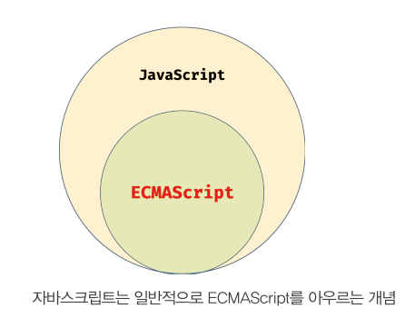

# 2장 - 자바스크립트란?


## 2.1 자바스크립트의 탄생

* 1995년, 약 90% 시장 점유율로 웹 브라우저 시장을 지배한 넷스케이프 커뮤니케이션즈<sup>Netscape communications</sup> 가 있었다.
* 웹 페이지 보조 기능 수행을 위하여 브라우저에서 동작하는 경량 프로그래밍 언어를 도입한 것이 바로 자바스크립트이다.
* 자바스크립트는 1996년 3월, 넷스케이프 커뮤니케이션즈  웹 브라우저인 넷스케이프 네비게이터<sup>Netscape Navigator</sup> 2 에 탑재됐으며, 모카<sup>Mocha</sup> 로 명명되었다.
* 그러다 1996년 9월, "라이브스크립트<sup>LiveScript</sup>" 로 이름이 바뀌었다가 12월에 "자바스크립트<sup>JavaScript</sup>" 라는 이름으로 최종 명명되었다

* 얼마 지나지 않아 자바스크립트 파생 버전인 JScript 가 자바스크립트는 위기를 맞는다.


## 2.2 자바스크립트의 표준화

* 1996년 8월, 마이크로소프트는 자바스크립트의 파생 버전인 "JScript" 를 인터넷 익스플로러<sup>Internet Explorer</sup> 3.0 에 탑재했다. 

* 문제는 JScript 와 자바스크립트가 표준화되지 못하고 적당히 호환되었다는 점이다.

* 즉, 넷스케이프 커뮤니케이션즈와 마이크로소프트는 자사 브라우저 시장 점유율을 높이기 위해 자사 브라우저에서만 동작하는 기능을 경쟁적으로 추가하기 시작했다는 것이다.

* 이로 인해 브라우저에 따라 웹페이지가 정상적으로 동작하지 않는 **크로스 브라우징 이슈**가 발생하기 시작했고다.

* 결과적으로 모든 브라우저에서 정상적으로 동작하는 웹페이지를 만들기가 어려워졌으므로 표준화된 자바스크립트의 필요성이 대두되었다.

* 그래서 1996년 11월 넷스케이프 커뮤니케이션즈는 컴퓨터 시스템의 표준을 관리하는 비영리 표준화 기구인 ECMA 인터내셔널에 자바스크립트 표준화를 요청한다.

* 1997년 7월, ECMA-262  라 불리는 표준화된 자바스크립트 초판(ECMAScript 1) 사양<sup>specification</sup>이 완성되었고, 상표권 문제로 자바스크립트는 ECMAScript 로 명명되었다.

* 이후 ECMAScript 3 (ES3) 이 공개되고, 10년 만인 2009년에 출시된 ECMAScript 5 (ES5) 는 HTML5 와 함께 출현한 표준 사양이다.

* 2015년에 공개된 ECMAScript 6 (ECMAScript 2015, ES6) 는 let/const 키워드, 화살표 함수, 클래스, 모듈 등과 같이 범용 프로그래밍 언어로서 갖춰야 할 기능들을 대거 도입하는 큰 변화가 있었다.

* ES6 이후의 버전 업은 비교적 작은 기능을 추가하는 수준으로 매년 공개할 것으로 예고되었다.

* ECMAScript 버전별 특징은 다음과 같다.

  |         버전          | 출시 연도 |                             특징                             |
  | :-------------------: | :-------: | :----------------------------------------------------------: |
  |          ES1          |   1997    |                             초판                             |
  |          ES2          |   1998    |         ISO/IEC 16262 국제 표준과 동일한 규격을 적용         |
  |          ES3          |   1999    |                  정규 표현식, try ... catch                  |
  |          ES5          |   2009    | HTML5 와 함께 출현한 표준안.<br/> JSON, strict mode, 접근자 프로퍼티, 프로퍼티 어트리뷰트 제어,<br />향상된 배열 조작 기능(forEach, map, filter, reduce, some, every) |
  | ES6(ECMAScript 2015)  |   2015    | let/const, 클래스, 화살표 함수, 템플릿 리터럴, 디스럭처링 할당, 스프레드 문법, rest 파라미터, 심벌, 프로미스, Map/Set, 이터러블, for .. of, 제너레이터, Proxy, 모듈 import/export |
  | ES7(ECMAScript 2016)  |   2016    | 지수(**) 연산자, Array.prototype.includes, String.prototype.includes |
  | ES8(ECMAScript 2017)  |   2017    | async/await, Object 정적 메서드(Object.values, Object.entries, Object.getOwnPropertyDescriptors) |
  | ES9(ECMAScript 2018)  |   2018    | Object rest/spread 프로퍼티, Promise.prototype.finally, async generator, for await...of |
  | ES10(ECMAScript 2019) |   2019    | Object.fromEntries, Array.prototype.flat, Array.prototype.flatMap,. optional catch binding |
  | ES11(ECMAScript 2020) |   2020    | String.prototype.matchAll, BigInt, globalThis, Promise.allSettled, null 병합 연산자, 옵셔널 체이닝 연산자, for ... in enumeration order |


## 2.3 자바스크립트 성장의 역사

* 초창기 자바스크립트는 웹페이지의 보조적인 기능을 수행하기 위해 한정적인 용도로 사용되었다.

* 이 시기에 대부분 로직은 주로 웹 서버에서 실행되었고, 브라우저는 서버로 부터 전달받은 HTML, CSS 를 단순히 렌더링하는 수준이었다.

* 렌더링

  ```
  렌더링이란 HTML, CSS, 자바스크립트로 작성된 문서를 해석해서 브라우저에 시각적으로 출력하는 것을 말한다. 때로는 서버에서 데이터를 HTML로 변환해서 브라우저에게 전달하는 과정(SSR; Server Side Rendering) 을 가리키도 한다.
  ```


### 2.3.1 Ajax

* 등장 배경

  * 이전의 웹페이지는 html 태그로 시작해서 html 태그로 끝나는 완전한 HTML 코드를 서버로부터 전송받아 웹페이지 전체를 렌더링하는 방식으로 동작했다. 

  * 따라서 화면이 전환될 경우 서버로부터 새로운 HTML 을 전송 받아서 웹페이지 전체를 처음부터 다시 렌더링 해야했다.

  * 이러한 방식은 변경할 필요가 없는 부분까지 포함된 HTML 코드를 서버로 부터 다시 전송받기 때문에 불필요한 데이터 통신이 발생, 변경할 필요가 없는 부분까지 처음부터 다시 렌더링 해야 하므로 성능 면에서 불리하다.

  * 이로 인해 화면 전환이 발생하면 순간적으로 깜박이는 현상이 발생하고, 이는 웹페이지의 어쩔 수 없는 한계로 받아들여졌다.

* 등장 이후

  * 1999년, 자바스크립트를 이용해 서버와 브라우저가 **비동기<sup>asynchronous</sup>** 방식으로 데이터를 교환할 수 있는 통신 기능인 **Ajax<sup>Asynchronous JavaScript and XML</sup>** 가 XMLHttpRequest 라는 이름으로 등장했다.

  * Ajax 의 등장으로 웹페이지에서 변경할 필요가 없는 부분은 다시 렌더링하지 않고, 서버로붙터 필요한 데이터만 전송받아 변경해야 하는 부분만 한정적으로 렌더링하는 방식이 가능해졌다.

  * 이로써 웹 브라우저에서도 데스크톱 애플리케이션과 유사한 빠른 성능과 부드러운 화면 전환이 가능해졌다.

  * 2005년, 구글이 발표한 **구글 맵스<sup>Google Maps</sup>** 는 웹 애플리케이션 프로그래밍 언어로서 자바스크립트 가능성을 확인하는 계기를 마련했다. 

  * 웹 브라우저에서 자바스크립트, Ajax 를 기반으로 동작하는 구글 맵스가 데스크톱 애플리케이션과 비교했을 때, 손색이 없을 정도의 성능과 부드러운 화면 전환 효과를 보여준 것이다.


### 2.3.2 jQuery

* 2006년, **jQuery** 의 등장으로 다소 번거롭고 논란이 있던 **DOM<sup>Document Object Model</sup>** 을 더욱 쉽게 제어할 수 있게 되었고 크로스 브라우징 이슈도 어느 정도 해결되었다.
* jQuery 는 넓은 사용자 층을 순식간에 확보했다. 이로 인해 배우기가 다소 까다로운 자바스크립트보다 배우기 쉽고 직관적인 jQuery 를 더 선호하는 개발자가 양산되기도 했다.


### 2.3.3 V8 자바스크립트 엔진

* 구글 맵스를 통해 웹 애플리케이션 프로그래밍 언어로서의 가능성이 확인된 자바스크립트로 웹 애플리케이션을 구축하려는 시도가 늘면서 더욱 빠르게 동작하는 자바스크립트 엔진의 필요성이 대두되었다.
* 2008년 등장한 구글의 **V8 자바스크립트 엔진**은 이러한 요구에 부합하는 빠른 성능을 보여주었다.
* V8 자바스크립트 엔진의 등장으로 자바스크립트는 데스크톱 애플리케이션과 유사한 사용자 경험(UX; user experience)을 제공할 수 있는 웹 애플리케이션 프로그래밍 언어로 정착하게 되었다.
* V8 자바스크립트 엔진으로 촉발된 자바스크립트 발전으로 과거 웹 서버에서 수행되던 로직들이 대거 클라이언트(브라우저)로 이동했다.
* 이는 웹 애플리케이션 개발에서 프론트엔드 영역이 주목받는 계기로 작용했다.


### 2.3.4 Node.js

* 2009년, 라이언 달이 발표한 Node.js 는 구글 V8 자바스크립트 엔진으로 빌드된 자바스크립트 런타임 환경이다.
* Node.js 는 브라우저의 자바스크립트 엔진에서만 동작하던 자바스크립트를 브라우저 이외의 환경에서도 동작할 수 있도록 자바스크립트 엔진을 브라우저에서 독립시킨 자바스크립트 실행 환경이다.
* Node.js 는 다양한 플랫폼에 적용할 수 있지만 서버 사이드 애플리케이션 개발에 주로 사용되며, 이에 필요한 모듈, 파일 시스템, HTTP 등 빌트인<sup>built-in, 내장</sup> API 를 제공한다.
* Node.js 는 자바스크립트 엔진을 기반으로 하므로 Node.js 환경에서 동작하는 애플리케이션은 자바스크립트를 사용해 개발한다.
* 프론트/백엔드 영역에서 자바스크립트를 사용할 수 있다는 동형성<sup>isomorphic</sup>은 별도의 언어를 학습하기 위한 시간을 덜 수 있다는 장점이 있다.
* Node.js 는 **비동기 I/O **를 지원하며 **단일 스레드<sup>single thread</sup> 이벤트 루프** 기반으로 동작함으로써 요청 처리 성능이 좋다.
* 따라서 데이터를 실시간으로 처리하기 위해 I/O가 빈번하게 발생하는 **SPA<sup>Single Page Application</sup>**에 적합하다. 
* 하지만 CPU 사용률이 높은 애플리케이션에는 권장하지 않는다.


### 2.3.5 SPA 프레임워크

* 모던 웹 애플리케이션은 데스크톱 애플리케이션과 비교해도 손색없는 성능과 사용자 경험을 제공하는 것이 필수가 되었다.
* 더불어 개발 규모, 복잡도도 상승했기 때문에 이전 개발 방식으로 개발 과정을 수행하기 어려워졌고, 이러한 필요에 따라 많은 패턴과 라이브러리가 출현했다.
* 그 덕에 개발에 많은 도움을 주었지만 변경에 유연하면서 확장하기 쉬운 애플리케이션 아키텍쳐 구축을 어렵게 했고, 필연적으로 프레임워크가 등장하게 되었다.
* 이러한 요구에 발맞춰 CBD<sup>Component Based Development</sup> 방법론을 기반으로 하는 SPA <sup>Single Page Application</sup> 가 대중화되면서 Angular, React, Vue.js, Svelte 등 다양한 SPA 프레임워크/라이브러리 또한 많은 사용층을 확보하고  있다.


## 2.4 자바스크립트와 ECMAScript

* ECMAScript 는 자바스크립트의 표준 사양인 ECMA-262 를 말하며, 프로그래밍 언어의 값, 타입, 객체와 프로퍼티, 함수, 표준 빌트인 객체<sup>standard built-in object</sup> 등 핵심 문법을 규정한다.

* 각 브라우저 제조사는 ECMAScript 사양을 준수해서 브라우저에 내장되는 자바스크립트 엔진을 구현한다.

* 자바스크립트는 일반적으로 프로그래밍 언어로서 기본 뼈대를 이루는 ECMAScript 와 브라우저가 별도로 지원하는 **클라이언트 사이드 Web API**, 즉 DOM, BOM, Canvas, XMLHttpRequest, fetch, requestAnimationFrame, SVG, Web Storage, Web Component, Web Worker 등을 아우르는 개념이다.

  

* 클라이언트 사이드 Web API 는 ECMAScript 와 별도로 월드 와이드 웹 콘소시엄<sup>World Wide Web Consortium; W3C</sup>에서 별도의 사양으로 관리하고 있다. 
* 클라이언트 사이드 Web API 의 자세한 내용은 [다음 사이트](https://developer.mozilla.org/ko/docs/Web/API)를 참조한다.


## 2.5 자바스크립트 특징

* 자바스크립트는 HTML, CSS 와 함께 웹을 구성하는 요소 중 하나로 **웹 브라우저에서 동작하는 유일한 프로그래밍 언어**이다. 

* 다른 프로그래밍 언어와 마찬가지로 자바스크립트는 기존 프로그래밍 언어에서 많은 영향을 받았다.

* 기본 문법은 C, Java 와 유사하고 셀프<sup>Self</sup>에서는 프로토타입 기반 상속을, 스킴<sup>Scheme</sup>에서는 일급 함수 개념을 차용했다.

* 자바스크립트는 개발자가 별도 컴파일 작업을 하지 않는 **인터프리터 언어<sup>interpreter language</sup>**이다.

* 대부분 모던 자바스크립트 엔진(크롬 V8, 파이어폭스 SpiderMonkey, 사파리 JavaScriptCore, 엣지 Chakra 등)은 인터프리터, 컴파일러 장점을 결합해 비교적 속도 처리가 느린 인터프리터의 단점을 해결했다.

* 인터프리터는 소스 코드를 즉시 실행하고 컴파일러는 빠르게 동작하는 머신 코드를 생성하고 최적화한다.

* 이를 통해 컴파일 단계에서 추가적 시간이 필요함에도 더욱 빠르게 코드를 실행할 수 있다.

* 컴파일러 언어/인터프리터 언어

  |                        컴파일러 언어                         |                       인터프리터 언어                        |
  | :----------------------------------------------------------: | :----------------------------------------------------------: |
  | 코드 실행 전 단계인 컴파일 타임에 소스 코드 전체를 한번에 머신 코드로 변환 후 실행 | 코드가 실행되는 단계인 런타임에 문 단위로 한 줄씩 중간 코드<sup>intermediate code</sup>인 바이트 코드로 변환 후 실행 |
  |                       실행 파일 생성 O                       |                       실행 파일 생성 X                       |
  | 컴파일 단계, 실행 단계가 분리되어 있다. 명시적 컴파일 단계를 거치고 명시적으로 실행 파일을 실행한다. | 인터프리트 단계와 실행 단계가 분리되어 있지 않다. 인터프리터는 한 줄씩 바이트코드로 변환하고 즉시 실행한다. |
  |           실행에 앞서 컴파일은 단 한번만 수행된다.           |    코드가 실행될 때마다 인터프리트 과정이 반복 수행된다.     |
  |  컴파일, 실행 단계가 분리되어 있어 코드 실행 속도가 빠르다.  | 인터프리트 단계, 실행 단계가 분리되어 있지 않고 반복 수행되어 코드 실행 속도가 비교적 느리다. |

  

* 하지만 대부분 모던 브라우저에서 사용되는 인터프리터는 전통적 컴파일러 언어처럼 명시적 컴파일 단계는 거치진 않지만 복잡한 과정을 거치며 일부 소스 코드를 컴파일하고 실행한다.

* 이를 통해 인터프리터 언어 장점인 동적 기능 지원을 살리면서 실행 속도가 느리다는 단점을 극복한다.

* 따라서 현재는 컴파일러/인터프리터 기술적 구분이 점차 모호해져 가는 추세다.

* 하지만 자바스크립트는 런타임에 컴파일되며 실행 파일이 생성되지 않고 인터프리터 도움 없이 실행할 수 없기 때문에 컴파일러 언어라고 할 수 없다.

* 

## 정리

1. 
